# DocumentCompanion - Advanced AI-Powered Document Learning Platform

<div align="center">

**🚀 Transform any document into an intelligent, interactive learning experience**


[🎯 Features](#-features) • [🏗️ Architecture](#️-architecture) • [🚀 Quick Start](#-quick-start) • [🏆 Competition Setup](COMPETITION_SETUP.md) • [📖 Documentation](#-documentation) • [🤖 AI System](#-ai-system) • [🔧 API Reference](#-api-reference)

</div>

## 📋 Table of Contents

- [🎯 Features](#-features)
- [🏗️ Architecture](#️-architecture)
- [🚀 Quick Start](#-quick-start)
- [📖 Documentation](#-documentation)
- [🤖 AI System](#-ai-system)
- [🔧 API Reference](#-api-reference)
- [🎨 UI Components](#-ui-components)
- [🌐 Internationalization](#-internationalization)
- [⚡ Performance](#-performance)
- [🛠️ Development](#️-development)
- [📊 Monitoring](#-monitoring)
- [🔒 Security](#-security)
- [📄 License](#-license)

## 🎯 Features

### 🧠 **Advanced AI-Powered Learning**
- **Multi-Agent AI System**: 8 specialized agents working in perfect coordination
- **Intelligent Document Analysis**: Advanced NLP and semantic understanding
- **Adaptive Learning**: Personalized content based on user progress and feedback
- **Context-Aware Explanations**: Deep understanding of document content
- **Cross-Reference Discovery**: Automatic connection finding across documents
- **Real-Time Learning**: Agents learn from user feedback and interactions
- **Expertise Building**: Auto-learning system that builds domain expertise (1-10 levels)

### 🤖 **AI Agent Ecosystem**

#### **Core AI Agents**
- **Text Analysis Agent**: Document processing and semantic insights
- **Study Assistant**: Personalized learning support and guidance
- **Insight Generation Agent**: Deep analysis and cross-document connections
- **Learning Agent**: Advanced knowledge acquisition and expertise building
- **Discussion Agent**: Interactive conversations with tool call abstraction
- **Quiz Agent**: Automated assessment creation with adaptive difficulty
- **AI Teacher Agent**: Expert teaching and educational guidance
- **Auto-Learning System**: Autonomous knowledge acquisition and improvement

#### **🆕 AI Navigation Agent** *(Latest Integration)*
- **Universal Definition Search**: Real-time term definitions and explanations
- **DuckDuckGo Integration**: Free, unlimited web search for definitions
- **Context-Aware Analysis**: Understands document context and chapter relevance
- **Smart Suggestions**: AI-generated search suggestions based on content
- **Learning Integration**: Stores learned terms and builds user vocabulary
- **Feedback System**: Learn from user feedback to improve responses
- **Multi-Language Support**: Definitions in 6+ languages
- **Drag & Drop Interface**: Floating, draggable panel for seamless use

### 🔬 **Advanced Subject-Specific Capabilities**

#### **📐 Mathematics & Mathematical Sciences**
Your AI Library has **comprehensive math book support** with specialized features:

**🎯 Math-Specific Capabilities:**
- **Domain Detection**: Automatically detects mathematical content (calculus, algebra, geometry, statistics, probability)
- **Mathematical Definitions**: `['mathematical_definition', 'formal_notation', 'theoretical_properties']`
- **Equation Recognition**: Understands mathematical formulas and notation
- **Theoretical Properties**: Comprehends mathematical concepts and relationships
- **Math Expert Personas**: `'As a mathematics educator'` for specialized explanations

**📚 Math-Specific Smart Suggestions:**
- `'Define: derivative'`, `'Explain: integral'`, `'What is: limit'`
- `'Define: function'`, `'Explain: equation'`, `'What is: calculus'`
- `'Define: matrix'`, `'Explain: probability'`

**🔧 What Math Books Can Do:**
✅ **Understand mathematical notation and formulas**
✅ **Explain complex mathematical concepts**
✅ **Generate math-specific quizzes and problems**
✅ **Provide step-by-step mathematical explanations**
✅ **Find mathematical definitions and theorems**
✅ **Discuss mathematical theories and proofs**
✅ **Adapt explanations to different math levels**

#### **🔬 Science & Scientific Research**
Your AI Library has **excellent science book support** across all disciplines:

**🎯 Science-Specific Capabilities:**

**Physics & Quantum Mechanics:**
- **Quantum mechanics**: particle, wave, probability, superposition, entanglement
- **Energy**: potential, kinetic, conservation, force, work
- **Matter**: mass, atom, molecule, element, compound
- **Motion**: velocity, acceleration, momentum, friction
- **Waves**: frequency, amplitude, wavelength, interference
- **Thermodynamics**: temperature, heat, entropy, thermal, pressure
- **Electromagnetism**: electric, magnetic, charge, current, field
- **Relativity**: spacetime, einstein, gravity, mass-energy

**Biology & Life Sciences:**
- **Cell biology**: cell, dna, genetics, organism
- **Evolution**: species, ecosystem, adaptation
- **Photosynthesis**: plant processes, energy conversion
- **Genetics**: inheritance, dna, genetic code

**Chemistry & Molecular Science:**
- **Molecular chemistry**: molecule, compound, reaction
- **Periodic table**: element, periodic, chemical
- **Chemical bonds**: bond, reaction, compound
- **Chemical processes**: reaction, synthesis, analysis

**Medical & Health Sciences:**
- **Medical terminology**: disease, treatment, patient, diagnosis
- **Clinical concepts**: therapy, clinical, medical
- **Health sciences**: health, medical, treatment

**🔬 Science-Specific Expert Personas:**
- **Physics Professor**: `'As a physics professor'`
- **Biology Expert**: `'As a biology expert'`
- **Chemistry Specialist**: `'As a chemistry specialist'`
- **Medical Professional**: `'As a medical professional'`

**🔬 Science-Specific Focus Areas:**
```typescript
// Different focus areas for different sciences
if (isQuantumPhysics) {
  focusAreas = ['quantum_mechanical_definition', 'mathematical_formulation', 'physical_interpretation'];
} else if (isPhysics) {
  focusAreas = ['physics_definition', 'theoretical_foundation', 'mathematical_relationships'];
} else if (isScience) {
  focusAreas = ['scientific_definition', 'empirical_evidence', 'theoretical_framework'];
}
```

**🔬 What Science Books Can Do:**
✅ **Understand complex scientific terminology**
✅ **Explain scientific concepts with examples**
✅ **Connect theoretical concepts to practical applications**
✅ **Provide historical context for scientific discoveries**
✅ **Generate science-specific quizzes and assessments**
✅ **Discuss experimental methodology and research design**
✅ **Adapt explanations to different science levels**
✅ **Multi-language science support**

**🔬 Advanced Science Features:**
- **Scientific notation preservation**
- **Mathematical formula understanding**
- **Experimental design analysis**
- **Research methodology comprehension**
- **Cross-disciplinary science connections**
- **Historical scientific context**
- **Practical laboratory applications**

**🎓 Example Science Interactions:**
- **User**: "What is quantum entanglement?" → **AI**: Provides quantum mechanical definition with mathematical formulation
- **User**: "Explain photosynthesis" → **AI**: Explains biological process with chemical reactions and energy conversion
- **User**: "How do chemical bonds work?" → **AI**: Explains molecular chemistry with electron sharing and energy principles
- **User**: "Create a physics quiz about energy" → **AI**: Generates physics-specific questions about kinetic, potential, and conservation of energy

Your app is **exceptionally well-equipped** for science books across all disciplines - from basic physics to advanced quantum mechanics, from cell biology to molecular chemistry, and everything in between!

### 🎓 **Comprehensive Subject Support**

Your AI Library supports **25+ specialized domains** with expert-level understanding:

#### **🔬 Science & Technology**
- **Physics & Quantum Mechanics**: Energy, matter, motion, waves, thermodynamics, electromagnetism, relativity
- **Biology & Life Sciences**: Cell biology, evolution, genetics, photosynthesis, ecosystems
- **Chemistry & Molecular Science**: Molecular chemistry, periodic table, chemical bonds, reactions
- **Medicine & Health**: Medical terminology, clinical concepts, health sciences, treatment
- **Technology & Computing**: Programming, algorithms, AI, machine learning, cybersecurity

#### **📐 Mathematics & Quantitative Fields**
- **Mathematics**: Calculus, algebra, geometry, statistics, probability, equations, theorems
- **Economics & Finance**: Markets, monetary policy, investment, banking, cryptocurrency, CBDC
- **Business & Management**: Strategy, marketing, leadership, entrepreneurship, corporate

#### **🧠 Social Sciences & Humanities**
- **Psychology**: Behavior, cognitive, mental health, personality, therapy
- **Sociology**: Society, culture, community, institutions, demographics
- **Politics & Government**: Democracy, policy, law, constitution, political systems
- **Philosophy**: Ethics, metaphysics, epistemology, logic, virtue, justice
- **History**: Historical events, civilizations, wars, revolutions, ancient cultures
- **Literature**: Poetry, novels, literary analysis, narrative, storytelling
- **Linguistics**: Language, grammar, vocabulary, translation, communication

#### **🎨 Arts & Creative Fields**
- **Arts**: Painting, sculpture, aesthetics, creative design, artistic expression
- **Music**: Musical theory, instruments, composition, rhythm, melody
- **Education**: Teaching, learning, curriculum, pedagogy, student development

#### **🌍 Religion & Spirituality**
- **Biblical Studies**: Christian theology, scripture, church, spiritual concepts
- **Islamic Studies**: Quran, Islamic theology, mosque, Islamic concepts
- **Buddhist Studies**: Buddhism, meditation, karma, dharma, enlightenment
- **Hindu Studies**: Hinduism, yoga, Sanskrit, Vedic concepts, chakras

#### **💼 Professional & Personal Development**
- **Self-Help & Personal Development**: Motivation, success, productivity, leadership, goals
- **Sports & Fitness**: Exercise, training, athletics, competition, physical health
- **Travel & Geography**: Countries, cultures, tourism, exploration, destinations
- **Cooking & Food**: Recipes, cuisine, ingredients, culinary arts, nutrition

### **🎯 Expert Personas for Each Domain**

Your AI adapts to each subject with specialized expert personas:

```typescript
const expertPersonas = {
  'Science/Physics': 'As a physics professor',
  'Science/Biology': 'As a biology expert', 
  'Science/Chemistry': 'As a chemistry specialist',
  'Technology/Computing': 'As a technology expert',
  'Medicine/Health': 'As a medical professional',
  'Mathematics': 'As a mathematics educator',
  'Psychology': 'As a psychology expert',
  'Sociology': 'As a sociology scholar',
  'Economics/Business': 'As a business and economics expert',
  'Politics/Government': 'As a political science expert',
  'Philosophy': 'As a philosophy scholar',
  'History': 'As a history expert',
  'Literature': 'As a literature scholar',
  'Arts': 'As an art expert',
  'Music': 'As a music expert',
  'Linguistics': 'As a linguistics expert',
  'Religious/Biblical Studies': 'As a biblical scholar',
  'Religious/Islamic Studies': 'As an Islamic studies scholar',
  'Religious/Buddhist Studies': 'As a Buddhist studies expert',
  'Religious/Hindu Studies': 'As a Hindu studies scholar',
  'Self-Help/Personal Development': 'As a personal development coach',
  'Education': 'As an education expert',
  'Sports/Fitness': 'As a fitness and sports expert',
  'Travel/Geography': 'As a travel and geography expert',
  'Cooking/Food': 'As a culinary expert'
};
```

### **🔧 Universal Capabilities Across All Subjects**

✅ **Domain-Specific Analysis**: Each subject gets specialized analysis and insights
✅ **Expert-Level Explanations**: AI adapts to provide expert-level understanding
✅ **Subject-Specific Quizzes**: Generate assessments tailored to each domain
✅ **Cross-Disciplinary Connections**: Find relationships between different fields
✅ **Multi-Language Support**: All subjects supported in 6+ languages
✅ **Adaptive Learning**: Adjusts complexity based on user level
✅ **Historical Context**: Provides background and development of concepts
✅ **Practical Applications**: Connects theory to real-world usage
✅ **Research Methodology**: Understands experimental and analytical approaches
✅ **Cultural Sensitivity**: Respects different cultural and religious perspectives

### **🎓 Example Interactions Across Subjects**

**📐 Mathematics**: "Explain derivatives" → **AI**: Provides mathematical definition with formal notation
**🔬 Physics**: "What is quantum entanglement?" → **AI**: Explains quantum mechanics with mathematical formulation
**📚 Literature**: "Analyze this poem's themes" → **AI**: Provides literary analysis with cultural context
**💼 Business**: "Explain market dynamics" → **AI**: Offers business insights with economic principles
**🌍 History**: "What caused the Industrial Revolution?" → **AI**: Provides historical analysis with social context
**🎨 Arts**: "Explain impressionism" → **AI**: Describes artistic movement with cultural significance
**🧠 Psychology**: "How does memory work?" → **AI**: Explains cognitive processes with research backing
**🌍 Religion**: "What is karma in Buddhism?" → **AI**: Explains spiritual concepts with cultural sensitivity

Your AI Library is **universally capable** - whether you're studying advanced quantum physics, analyzing Shakespeare, learning about ancient civilizations, or exploring personal development, your AI adapts to provide expert-level assistance in any field!

### 🚀 **Future Roadmap & Planned Integrations**

#### **🤖 Google AI Models Integration** *(Coming Soon)*
Your AI Library is expanding to include **comprehensive Google AI model support**:

**📋 Planned Google AI Models:**
- **Gemini Pro** - Advanced reasoning and analysis
- **Gemini Flash** - Fast, efficient responses
- **Gemini Ultra** - Most capable model for complex tasks
- **Gemini Nano** - Lightweight, efficient processing
- **PaLM 2** - Large language model capabilities
- **Codey** - Specialized code generation and analysis
- **Imagen** - Advanced image generation and analysis
- **Chirp** - Speech-to-text and audio processing
- **Universal Speech Model** - Multi-language speech recognition

**🔗 Google AI Services Integration:**
- **Vertex AI** - Managed ML platform integration
- **Google Cloud AI** - Enterprise-grade AI services
- **AutoML** - Custom model training capabilities
- **AI Platform** - Scalable machine learning infrastructure

#### **🧠 Advanced Embedding Models** *(Planned)*
**Comprehensive embedding model support** for enhanced semantic search and understanding:

**📊 Planned Embedding Models:**
- **text-embedding-gecko-001** - Google's efficient text embeddings
- **text-embedding-gecko-002** - Enhanced semantic understanding
- **text-embedding-gecko-003** - Latest generation embeddings
- **text-embedding-001** - Universal text embeddings
- **text-embedding-002** - Improved semantic search
- **text-embedding-003** - Advanced language understanding
- **text-embedding-004** - Latest embedding capabilities
- **text-embedding-005** - Next-generation embeddings

**🎯 Enhanced Capabilities with Google AI:**
- **Multi-Modal Understanding** - Text, images, audio, video
- **Advanced Reasoning** - Complex problem-solving capabilities
- **Code Generation** - Specialized programming assistance
- **Creative Content** - Image and text generation
- **Speech Processing** - Real-time audio analysis
- **Enterprise Features** - Scalable, secure AI services
- **Custom Training** - Domain-specific model fine-tuning
- **Advanced Analytics** - Deep learning insights

**🔧 Technical Integration Plans:**
- **Google AI SDK** - Native integration with Google's AI services
- **Vertex AI Integration** - Managed ML platform connectivity
- **Cloud AI APIs** - Enterprise-grade AI capabilities
- **Custom Model Training** - Domain-specific AI development
- **Multi-Model Orchestration** - Intelligent model selection
- **Advanced Caching** - Optimized response times
- **Real-time Processing** - Live AI interactions
- **Scalable Infrastructure** - Enterprise-ready deployment

**📈 Benefits of Google AI Integration:**
- **Enhanced Accuracy** - State-of-the-art AI models
- **Multi-Modal Support** - Text, image, audio, video processing
- **Enterprise Security** - Google Cloud security standards
- **Scalable Performance** - Cloud-native architecture
- **Advanced Analytics** - Deep learning insights
- **Custom Training** - Domain-specific model development
- **Real-time Processing** - Live AI interactions
- **Global Availability** - Worldwide AI service access

Your AI Library is evolving into a **comprehensive AI platform** that will leverage the full power of Google's AI ecosystem for enhanced learning, analysis, and interaction capabilities! 🌟

### 📚 **Document Processing**
- **Universal Format Support**: PDF, TXT, and various document types
- **Smart Chapter Detection**: AI-assisted content structuring
- **Intelligent Pagination**: Optimal reading experience
- **Content Enhancement**: Automatic formatting and organization
- **Multi-Language Processing**: Support for 6+ languages

### 🗣️ **Voice & Audio**
- **Advanced Text-to-Speech**: Natural voice reading with 40+ voices
- **AI-Enhanced Speech**: Intelligent emphasis and pacing
- **Voice Cloning**: Personalized reading experience
- **Audio Controls**: Speed, pitch, and voice customization
- **Reading Progress**: Audio-synced progress tracking

### 💬 **Interactive Features**
- **AI Discussion Agent**: Intelligent conversations about content
- **Study Assistant**: Personalized learning support
- **Quiz Generation**: Automated question creation
- **Power Summaries**: AI-generated chapter summaries
- **Insight Generation**: Deep analysis and connections

### 🎨 **User Experience**
- **Modern UI**: Beautiful, responsive design with Tailwind CSS
- **Dark/Light Mode**: Comfortable reading in any environment
- **Mobile Optimized**: Full functionality on all devices
- **Keyboard Navigation**: Complete accessibility support
- **Drag & Drop**: Intuitive file handling and note management

### 🔍 **Advanced Search**
- **Semantic Search**: Natural language queries
- **RAG Integration**: Retrieval-augmented generation
- **Cross-Document Search**: Find connections across all documents
- **Contextual Results**: Intelligent result ranking
- **Search Analytics**: Learning from search patterns

### 📊 **Analytics & Monitoring**
- **Performance Dashboard**: Real-time system monitoring
- **Learning Analytics**: Track progress and patterns
- **AI Agent Monitoring**: System health and performance
- **User Engagement**: Detailed usage statistics
- **Cache Performance**: Optimization metrics

### 🧠 **Adaptive Learning System**
- **Personalized Content**: Adapts to user learning style and level
- **Feedback Integration**: Learns from user corrections and preferences
- **Expertise Tracking**: Monitors user progress across domains
- **Performance Analytics**: Detailed learning velocity and growth metrics
- **Continuous Improvement**: Agents improve responses based on feedback
- **Memory System**: Remembers user interactions and preferences

## 🏗️ Architecture

```mermaid
graph TB
    %% User Interface Layer
    subgraph "🎨 Frontend (React + TypeScript)"
        UI[Document Reader UI]
        Chat[AI Chat Interface]
        Voice[Voice Reader]
        Search[Search Interface]
        Nav[🆕 Navigation Agent Panel]
        Theme[Dark/Light Theme]
    end

    %% API Gateway Layer
    subgraph "🌐 API Gateway"
        API[Express.js API]
        WS[WebSocket Server]
        Auth[Authentication]
    end

    %% AI Agent Coordination Layer
    subgraph "🤖 AI Agent Manager"
        AM[Agent Manager]
        AM --> TA[Text Analysis Agent]
        AM --> SA[Study Assistant Agent]
        AM --> IG[Insight Generation Agent]
        AM --> LA[Learning Agent]
        AM --> DA[Discussion Agent]
        AM --> QA[Quiz Agent]
        AM --> TA2[AI Teacher Agent]
        AM --> AL[Auto-Learning System]
        AM --> NA[🆕 Navigation Agent]
    end

    %% Multi-Model AI Layer
    subgraph "🧠 Multi-Model AI System"
        G3N[Gemma 3N<br/>Primary Model]
        QWEN[Qwen2.5<br/>Creative Tasks]
        PHI[Phi3.5<br/>Fast Responses]
        MM[Model Router]
        MM --> G3N
        MM --> QWEN
        MM --> PHI
    end

    %% Services Layer
    subgraph "🔧 Core Services"
        OLLAMA[Ollama Service]
        RAG[RAG Service]
        SEARCH[Semantic Search]
        MEMORY[Memory Service]
        ADAPTIVE[Adaptive Learning]
        CACHE[Cache Service]
    end

    %% Data Layer
    subgraph "💾 Data Layer"
        DB[(SQLite Database)]
        KG[Knowledge Graph]
        VECTOR[Vector Store]
        CACHE_DB[Cache DB]
    end

    %% External Services
    subgraph "🌍 External Services"
        DDG[DuckDuckGo API<br/>🆕 Navigation Agent]
        TTS[Text-to-Speech]
        VOICE[Voice Cloning]
    end

    %% Data Flow
    UI --> API
    Chat --> API
    Voice --> API
    Search --> API
    Nav --> API
    API --> WS
    API --> AM
    AM --> MM
    MM --> OLLAMA
    OLLAMA --> G3N
    OLLAMA --> QWEN
    OLLAMA --> PHI
    
    %% Services Connections
    AM --> RAG
    AM --> SEARCH
    AM --> MEMORY
    AM --> ADAPTIVE
    RAG --> VECTOR
    SEARCH --> VECTOR
    MEMORY --> DB
    ADAPTIVE --> DB
    ADAPTIVE --> KG
    
    %% External Connections
    NA --> DDG
    Voice --> TTS
    Voice --> VOICE
    
    %% Database Connections
    API --> DB
    RAG --> DB
    SEARCH --> DB
    MEMORY --> DB
    ADAPTIVE --> DB
    CACHE --> CACHE_DB

    %% Styling
    classDef frontend fill:#e1f5fe,stroke:#01579b,stroke-width:2px
    classDef api fill:#f3e5f5,stroke:#4a148c,stroke-width:2px
    classDef agents fill:#e8f5e8,stroke:#1b5e20,stroke-width:2px
    classDef models fill:#fff3e0,stroke:#e65100,stroke-width:2px
    classDef services fill:#fce4ec,stroke:#880e4f,stroke-width:2px
    classDef data fill:#f1f8e9,stroke:#33691e,stroke-width:2px
    classDef external fill:#e0f2f1,stroke:#004d40,stroke-width:2px

    class UI,Chat,Voice,Search,Nav,Theme frontend
    class API,WS,Auth api
    class AM,TA,SA,IG,LA,DA,QA,TA2,AL,NA agents
    class G3N,QWEN,PHI,MM models
    class OLLAMA,RAG,SEARCH,MEMORY,ADAPTIVE,CACHE services
    class DB,KG,VECTOR,CACHE_DB data
    class DDG,TTS,VOICE external
```

<div align="center">



**🔄 System Architecture Overview**

</div>

### **Frontend (React + TypeScript)**
```
client/
├── src/
│   ├── components/          # UI components
│   │   ├── ai-agent-chat.tsx
│   │   ├── ai-navigation-agent.tsx    # 🆕 Latest integration
│   │   ├── ai-voice-reader.tsx
│   │   ├── document-content.tsx
│   │   └── ui/              # Radix UI components
│   ├── pages/               # Route components
│   ├── hooks/               # Custom React hooks
│   ├── contexts/            # React contexts
│   ├── services/            # API services
│   └── lib/                 # Utilities
```

### **Backend (Node.js + Express)**
```
server/
├── agents/                  # AI agent system
│   ├── agent-manager.ts     # Central coordination
│   ├── discussion-agent.ts  # Chat and conversations
│   ├── quiz-agent.ts        # Quiz generation
│   ├── text-analysis-agent.ts
│   ├── learning-agent.ts    # Advanced learning
│   ├── auto-learning-system.ts  # Autonomous learning
│   └── enhanced-agent-coordinator.ts
├── services/                # Core services
│   ├── ollama-service.ts    # AI model integration
│   ├── multi-model-service.ts  # Multi-model coordination
│   ├── adaptive-learning-service.ts  # Personalized learning
│   ├── document-rag-service.ts
│   └── semantic-search-service.ts
├── routes/                  # API routes
└── db.ts                    # Database configuration
```

### **Database Schema**
- **Documents**: File storage and metadata
- **Annotations**: User notes and highlights
- **Bookmarks**: Saved locations and references
- **AI Memories**: Intelligent content retention
- **Power Summaries**: AI-generated summaries
- **Learning Analytics**: Progress tracking
- **Knowledge Graph**: Concept relationships and expertise

## 🚀 Quick Start

> **🏆 Competition Judges**: For Google Gemma 3n Hackathon evaluation, see [COMPETITION_SETUP.md](COMPETITION_SETUP.md) for streamlined setup instructions.

### **Prerequisites**
- Node.js 18+ 
- npm or yarn
- Ollama (for AI features)

### **1. Installation**
```bash
# Clone the repository
git clone <repository-url>
cd DocumentCompanion

# Install dependencies
npm install
```

### **2. Database Setup**
```bash
# Generate database schema
npm run db:generate

# Run migrations
npm run db:migrate
```

### **3. AI Services Setup**
> **Note:** The main large language model (LLM) powering DocumentCompanion is **Gemma 3N**. Most AI features and agents use Gemma 3N as their primary model for advanced language understanding and generation.

```bash
# Install Ollama
curl -fsSL https://ollama.ai/install.sh | sh

# Pull recommended models
ollama pull gemma3n:e2b
ollama pull qwen2.5:7b-instruct
ollama pull llama3.2:3b
```

### **4. Development**
```bash
# Start development server
npm run dev

# Start full system with AI agents
npm run dev:full

# Access the application
open http://localhost:5000
```

### **5. Startup & Reset Script** 🚀
For easy development and troubleshooting, use the automated startup script:

```bash
# Default: Reset database AND start server (recommended)
node startup-reset.cjs

# Only reset database (no server start)
node startup-reset.cjs --reset

# Only start server (no database reset) 
node startup-reset.cjs --start

# Reset database then start server (explicit)
node startup-reset.cjs --reset --start

# Show help and all options
node startup-reset.cjs --help
```

#### **What the script does:**
- **🛑 Smart Server Management**: Automatically stops any running processes on port 5000
- **🔧 Complete Database Reset**: Deletes corrupted files and runs proper Drizzle migrations
- **👤 User Setup**: Creates default user with ID 2 for consistent document uploads
- **🌟 Server Launch**: Starts development server with helpful URLs
- **🎯 Error Prevention**: Ensures clean state and prevents conflicts

#### **Perfect for:**
- **Competition prep**: Ensure clean system state
- **Development**: Quick reset when testing features
- **Troubleshooting**: Fix database schema issues instantly
- **Fresh starts**: Complete system reset in one command

#### **Common use cases:**
```bash
# Fresh start for development
node startup-reset.cjs

# Just reset data without starting server
node startup-reset.cjs --reset

# Quick server restart without database changes
node startup-reset.cjs --start
```

### **6. Production Deployment**
```bash
# Build for production
npm run build

# Start production server
npm start
```

## 📖 Documentation

### **Core Concepts**

#### **Documents**
The platform processes documents into structured chapters with intelligent pagination. Each document maintains metadata, reading progress, and associated AI-generated content.

#### **AI Agents**
Specialized AI agents handle different aspects of learning:
- **Text Analysis Agent**: Document processing and insights
- **Study Assistant**: Personalized learning support
- **Insight Generation**: Deep analysis and connections
- **Learning Agent**: Advanced knowledge acquisition and expertise building
- **Discussion Agent**: Interactive conversations
- **Quiz Agent**: Automated assessment creation
- **AI Teacher Agent**: Expert teaching and educational guidance
- **Auto-Learning System**: Autonomous knowledge acquisition
- **🆕 AI Navigation Agent**: Universal definition search and context-aware analysis

> **Gemma 3N** is the primary LLM used by these agents for most advanced AI tasks in the system.

#### **🆕 AI Navigation Agent Features**
The latest integration provides:
- **Universal Definition Search**: Real-time term definitions using DuckDuckGo API
- **Context-Aware Analysis**: Understands document context and chapter relevance
- **Smart Suggestions**: AI-generated search suggestions based on content
- **Learning Integration**: Stores learned terms and builds user vocabulary
- **Feedback System**: Learn from user feedback to improve responses
- **Multi-Language Support**: Definitions in 6+ languages
- **Drag & Drop Interface**: Floating, draggable panel for seamless use

#### **Adaptive Learning System**
The platform features sophisticated adaptive learning:
- **Personalized Content**: Adapts to user learning style (visual/analytical/practical/theoretical)
- **Feedback Integration**: Learns from user corrections and preferences
- **Expertise Tracking**: Monitors user progress across domains (1-10 levels)
- **Performance Analytics**: Detailed learning velocity and growth metrics
- **Continuous Improvement**: Agents improve responses based on feedback
- **Memory System**: Remembers user interactions and preferences

### **AI Model Integration**

#### **Multi-Model System**
The platform uses multiple AI models for different tasks:
- **Gemma 3N (Primary)**: Advanced language understanding and generation
- **Qwen2.5**: Creative tasks and content generation
- **Phi3.5**: Fast responses and basic tasks
- **Intelligent Routing**: Automatically selects the best model for each task

#### **Learning Mechanisms**
- **Document Analysis**: Extracts concepts and builds expertise
- **Feedback Learning**: Improves responses based on user feedback
- **Cross-Document Synthesis**: Finds relationships between concepts
- **Memory Integration**: Stores and retrieves learned information
- **Expertise Building**: Tracks domain expertise levels (1-10)

### **API Endpoints**

#### **Core Endpoints**
```typescript
// Document Management
POST /api/documents/upload
GET /api/documents
GET /api/documents/:id

// AI Agent Communication
POST /api/ai/chat
POST /api/ai/quiz
POST /api/ai/summary

// Learning & Analytics
POST /api/ai-learning/feedback
GET /api/ai-learning/analytics
POST /api/ai-learning/session

// 🆕 Navigation Agent
POST /api/navigation/search
GET /api/navigation/suggestions
POST /api/navigation/feedback
```

#### **🆕 Navigation Agent API**
```typescript
// Search for definitions
POST /api/navigation/search
{
  "query": "term to search",
  "documentId": 1,
  "chapter": 1
}

// Get smart suggestions
GET /api/navigation/suggestions?documentId=1&chapter=1

// Submit feedback
POST /api/navigation/feedback
{
  "messageId": "msg_123",
  "feedback": "positive" | "negative",
  "reason": "optional explanation"
}
```

## 🤖 AI System

### **Agent Coordination**
The system uses a sophisticated agent coordination system:
- **Central Manager**: Coordinates all 8 AI agents
- **Intelligent Routing**: Routes tasks to the best agent
- **Context Sharing**: Agents share context and insights
- **Performance Monitoring**: Tracks agent performance and health

### **Learning Capabilities**
- **Document Learning**: Analyzes content and builds expertise
- **User Feedback Learning**: Improves based on user corrections
- **Cross-Document Learning**: Finds relationships between documents
- **Memory Integration**: Stores and retrieves learned information
- **Expertise Tracking**: Monitors domain expertise levels

### **🆕 Navigation Agent Intelligence**
- **Universal Search**: Searches multiple sources for definitions
- **Context Analysis**: Understands document and chapter context
- **Smart Suggestions**: Generates relevant search suggestions
- **Learning Integration**: Stores learned terms and builds vocabulary
- **Feedback Learning**: Improves responses based on user feedback

## 🎨 UI Components

### **Core Components**
- **Document Reader**: Advanced reading interface
- **AI Chat Interface**: Interactive conversations
- **Voice Reader**: Audio playback controls
- **Search Interface**: Semantic search capabilities
- **🆕 Navigation Agent Panel**: Floating, draggable definition search

### **🆕 Navigation Agent UI**
- **Draggable Panel**: Floating interface that can be moved anywhere
- **Smart Suggestions**: AI-generated search suggestions
- **Feedback System**: Thumbs up/down for responses
- **Learning Integration**: Shows learned terms and vocabulary
- **Multi-Language Support**: Definitions in user's preferred language

## 🌐 Internationalization

### **Supported Languages**
- English (Primary)
- Spanish (Español)
- French (Français)
- German (Deutsch)
- Chinese (中文)
- Japanese (日本語)

### **Translation Features**
- **Real-Time Translation**: Instant message translation
- **Context-Aware**: Maintains meaning in different languages
- **Learning Integration**: Translates definitions and explanations
- **User Preferences**: Remembers language preferences

## ⚡ Performance

### **Optimization Features**
- **Caching System**: Intelligent response caching
- **Lazy Loading**: Load content as needed
- **Compression**: Optimized data transfer
- **CDN Integration**: Fast content delivery
- **Database Optimization**: Efficient queries and indexing

### **AI Performance**
- **Model Selection**: Intelligent model routing for optimal performance
- **Response Caching**: Cache frequently requested responses
- **Parallel Processing**: Multiple agents working simultaneously
- **Memory Management**: Efficient memory usage and cleanup

## 🛠️ Development

### **Development Tools**
- **TypeScript**: Full type safety
- **ESLint**: Code quality enforcement
- **Prettier**: Code formatting
- **Husky**: Git hooks for quality
- **Jest**: Unit testing framework

### **Debugging Features**
- **Performance Monitoring**: Real-time system metrics
- **Error Tracking**: Comprehensive error logging
- **Agent Health**: Monitor AI agent performance
- **User Analytics**: Track user behavior and preferences

## 📊 Monitoring

### **System Metrics**
- **Performance Dashboard**: Real-time system monitoring
- **AI Agent Health**: Monitor agent performance and errors
- **User Engagement**: Track user behavior and preferences
- **Learning Analytics**: Monitor learning progress and patterns

### **AI Analytics**
- **Model Performance**: Track response times and accuracy
- **Learning Progress**: Monitor expertise building and feedback
- **User Satisfaction**: Track feedback and improvement rates
- **System Health**: Monitor overall system performance

## 🔒 Security

### **Data Protection**
- **Local Storage**: All data stored locally
- **Encryption**: Secure data transmission
- **Access Control**: User-based permissions
- **Privacy**: No data sent to external services (except DuckDuckGo for definitions)

### **AI Security**
- **Model Isolation**: Secure model execution
- **Input Validation**: Sanitize all user inputs
- **Error Handling**: Graceful error recovery
- **Rate Limiting**: Prevent abuse and overload

## 📄 License

This project is licensed under the **Creative Commons Attribution 4.0 International License (CC BY 4.0)** - see the [LICENSE](LICENSE) file for details.

**🏆 Competition Compliance**: This licensing meets the requirements for the Google Gemma 3n Hackathon winner obligations, allowing commercial use while ensuring proper attribution.

---

<div align="center">

**🌟 Built with ❤️ using React, TypeScript, and advanced AI technologies**

**🚀 Ready for production deployment and competition success!**

</div>